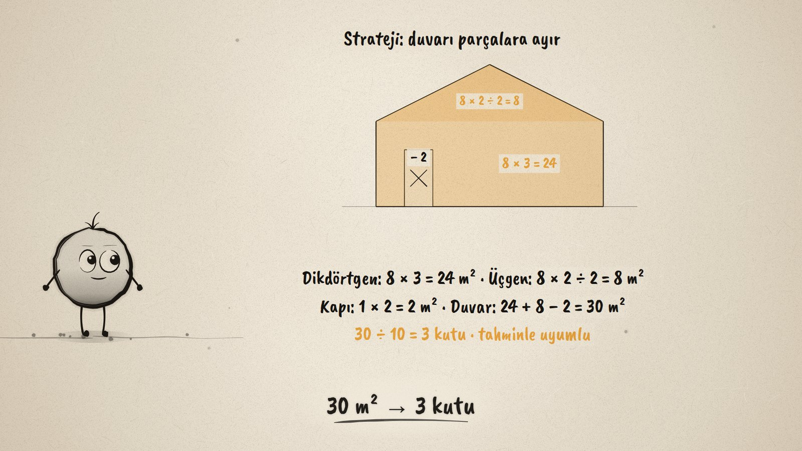
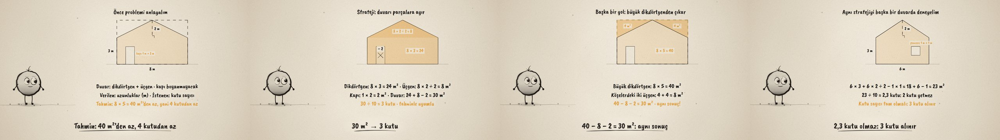

# Kaç Kutu Boya? · Real-Life Area Problems

**▶ Tarayıcıda izleyin / Watch in the browser:** https://hakanatas.github.io/kac-kutu-boya/ 
**⬇ MP4 + altyazılar / MP4 + subtitles:** [Releases](https://github.com/hakanatas/kac-kutu-boya/releases) 
**✎ Kullanılan istem / The prompt behind it:** [PROMPT.md](PROMPT.md) 
**🎞 Bütün filmler / All films:** [Nokta'nın Filmleri](https://hakanatas.github.io/nokta-filmleri/?sinif=6)

> **TR —** 6. sınıf matematik "Geometrik Nicelikler" temasındaki MAT.6.4.3 öğrenme çıktısı için hazırlanmış, tamamen JavaScript ile çizilen 92 saniyelik mürekkep animasyonu. Evin ön duvarı boyanacak; bir kutu boya 10 m² boyuyor. Kaç kutu gerekir? Bileşenler belirleniyor: duvar 8 m × 3 m'lik bir dikdörtgen ile yüksekliği 2 m olan bir üçgenden oluşuyor, 1 m × 2 m'lik kapı boyanmayacak. Tahmin: duvar 8 × 5'lik dikdörtgene sığıyor, yani 40 m²'den az, 4 kutudan az. Birinci yol: parçalara ayır, 24 + 8 − 2 = 30 m², 3 kutu. İkinci yol: büyük dikdörtgenden köşelerdeki iki üçgeni ve kapıyı çıkar, 40 − 8 − 2 = 30 m², aynı sonuç. Strateji başka bir duvara genelleniyor: 18 + 6 − 1 = 23 m², 23 ÷ 10 = 2,3 kutu; 2 kutu yetmediği için 3 kutu alınır. Altyazılar Türkçe, İngilizce ya da ikisi birlikte seçilebilir.

A 92-second ink animation for **6th-grade maths**, the third film of the fourth 6th-grade theme. Nokta, the ink character from [The Learning Ink](https://github.com/hakanatas/the-learning-ink), is the guide again. Both walls come from the same `wall` function in `scenes/scene1.js`, with the width and the door or window as its inputs, which is the generalisation the film asks for.

## Learning outcome

MEB, Türkiye Yüzyılı Maarif Modeli, Ortaokul Matematik, 6th grade, "Geometrik Nicelikler" theme:

**MAT.6.4.3. Geometrik şekillerin alanları ile modellenen gerçek yaşam durumlarına yönelik problem çözebilme**
- a) Geometrik şekillerin alanları ile modellenen gerçek yaşam probleminde ilgili matematiksel bileşenleri (alan, şekil, uzunluk, alan ölçme birimleri gibi) belirler.
- b) Matematiksel bileşenler arasındaki ilişkiyi belirler.
- c) Problem bağlamıyla ilişkili verilenleri uygun matematiksel temsillere dönüştürür.
- ç) Matematiksel temsillere dönüştürdüğü problemi kendi ifadeleri ile açıklar.
- d) Problemin sonucuna ilişkin tahminde bulunur ve işlemleri gerçekleştirmek için stratejiler geliştirir.
- e) Belirlediği stratejileri çözüm için uygular.
- f) Çözüm yollarını kontrol eder ve çözüme ulaştırmayan stratejiyi değiştirir.
- g) Problemin çözümü için kullandığı veya geliştirdiği stratejileri gözden geçirerek alternatif çözüm yollarını değerlendirir.
- ğ) Kullandığı strateji veya stratejileri farklı problemlerin çözümlerine geneller.
- h) Genellemenin geçerliliğini matematiksel örneklerle değerlendirir.

## Scenes

| # | Time | Scene | What happens | Outcome |
|---|---|---|---|---|
| 1 | 0–10 s | Boyanacak duvar | A house wall; one can paints 10 m². How many cans? | a |
| 2 | 10–28 s | Problemi anla | Rectangle + triangle, door excluded; given and asked; estimate under 40 m², under 4 cans. | a, b, c, ç, d |
| 3 | 28–46 s | Parçalara ayır | 24 + 8 − 2 = 30 m², 30 ÷ 10 = 3 cans, matching the estimate. | e, f |
| 4 | 46–62 s | Başka bir yol | 40 − 8 − 2 = 30 m² from the big rectangle: the same answer. | f, g |
| 5 | 62–80 s | Başka bir duvar | 18 + 6 − 1 = 23 m², 2.3 cans: 2 is not enough, buy 3. | ğ, h |
| 6 | 80–92 s | Aklında kalsın | Identify, estimate, split, check, interpret. | d–h |

## Running it

- **Preview:** double-click `index.html` (it works offline).
- **MP4:** run `npm install` once, then `npm run export -- --format=horizontal --captions=tr`.
- **Subtitles and narration:** `npm run srt` writes `out/captions_*.srt` and `narration_notes.txt`.
- **Editing:**
  - Caption text, timings and narration notes: `captions.js`
  - Everything on screen is drawn by `LI.world(t)` in `scenes/scene1.js` (the walls, their measurements, the two strategies, the words); the other scenes only set the camera.
  - Polygons, dashed lines and Nokta's poses: `src/draw/film.js`; layout for 16:9 and 9:16: `src/draw/kd.js`

It uses the same engine as The Learning Ink: `renderFrame(t)` as a pure function of time, seeded randomness, and frame-by-frame export.
